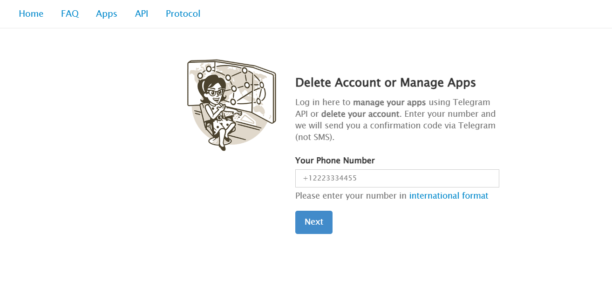
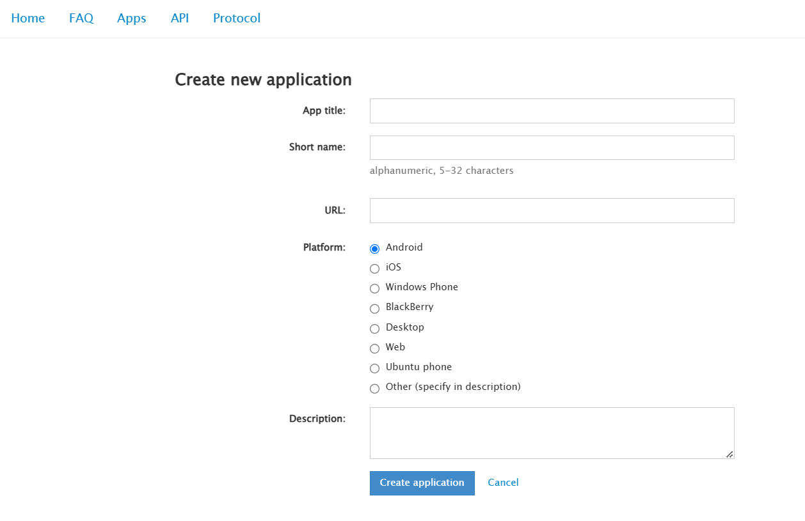

# evnt.

## Overview

**evnt.** is a robust tool for automating event management, designed to simplify organizing events across different industries. By automating tasks such as creating groups and adding members, 
**evnt.** enables organizers to concentrate on crafting impactful experiences instead of handling time-consuming administrative tasks.

<br />

## Problem Statement

Organizing events like hackathons, coding contests, and workshops often requires manual participant management, such as group creation and adding members. This process is time-consuming, especially for college-hosted or small-scale events with limited resources. A streamlined, automated solution is crucial to reduce administrative effort and enhance efficiency.

**evnt.** simplifies this process by automating group creation and participant management.

<br />

## Key Features

1. **Free and Open Source**: Ideal for small-scale events, this free, open-source tool streamlines group management and participant addition, providing a cost-effective alternative to complex, expensive platforms. Customize the source code to develop solutions tailored to your unique requirements.

2. **Enhanced Privacy**: Clone and run locally for full data control and enhanced privacy.

3. **Streamlined Participant Addition**: Automatically import participant data from CSVs and add to Telegram groups, minimizing errors and streamlining onboarding.

4. **User-Friendly Interface**: A clean and intuitive interface that allows users to navigate the application with ease, making event management straightforward and efficient.

<br />

## Team Members

1. [Abhay Balakrishnan](https://github.com/ABHAY-100)
2. [Aadithya Madhav](https://github.com/aadithyayy)
3. [Elvin J Alapatt](https://github.com/Elvin2605)
4. [Joshua Sebi](https://github.com/JoshuaSebi)

<br />

## Challenges Faced

During the 15-hour hackathon, we encountered two major challenges:

- **WhatsApp API Limitations**: Accessing the API was complex and risky, with unauthorized methods leading to potential bans.
- **Switch to Telegram**: By using Telegram's official API and MTProto protocol, we unlocked full user-level capabilities, overcoming the limitations of regular bots.

This transition ensured security, flexibility, and respect for user privacy.

<br />


## Getting Started

Follow these steps to set up evnt. locally:

### Prerequisites

Ensure you have the following installed:
- Node.js (v16 or higher)
- npm

### Installation

1. Clone the Repository

    ```bash
    git clone https://github.com/ABHAY-100/evnt.git
    ```
    
2. Navigate to the Project Directory
   
    ```bash
    cd evnt
    ```
    
3. Install Dependencies
   
    ```bash
    npm install
    ```

4. Set Up Environment Variables
   
   - Locate the `.env.example` file in the root of the project.
   - Create a new file named `.env` or `.env.local` in the root directory.
   - Copy and paste the contents of `.env.example` into the newly created `.env` file.

### Configure Telegram API

5. Access Telegram Developer Tools

   - Open [my.telegram.org](https://my.telegram.org) and log in with your phone number.
   - After logging in, click on **API Development Tools**.




6. Create a New Application by filling out the form with an appropriate **App Title** and **Short Name**.



7. Retrieve API Credentials
   - Once created, you will be shown a page with your **API_ID** and **API_HASH**.
   - Copy these values and paste them into the `.env` file under their respective keys.

8. Add Telegram Phone Number in the `.env` file in international format as ```TELEGRAM_PHONE_NUMBER=+<YourPhoneNumber>```

9. Generate `TELEGRAM_SESSION` and Update the Environment File
    - Run the following command to generate the `TELEGRAM_SESSION` string
      
      
      
        ```bash
        npx ts-node scripts/auth-telegram.ts
        ```
    - Follow the instructions in the terminal to authenticate your Telegram account.
    - Once the `TELEGRAM_SESSION` is generated, copy the output string.
    - Open your `.env` file and add the `TELEGRAM_SESSION` key with the copied string
      
   
      
      ```bash
      TELEGRAM_SESSION=<YourGeneratedSessionString>
      ```

### Run the Application

10. Start the Application

    ```bash
    npm run dev
    ```

11. Open your web browser and navigate to `http://localhost:3000` to access the app.

### How to Use?

12. Once the application is running, open it in your browser (`http://localhost:3000`), and you will see a form.

13. Select whether you want to create a group or channel using the switch option.

14. Enter the group/channel name and description in the corresponding fields.

15. Upload a CSV file containing participant data in the following format:
    ```bash
    name, phone
    johndoe, +91933222XXXX
    janedoe, +91933852XXXX
    ```

15. If everything is configured correctly, the members will be added automatically. A success modal will appear with event statistics, and a CSV report (named `group/channelname-report.csv`) will be downloaded with a summary of the process.


<br />


## How It Works?

### Technical Implementation

The application utilizes Telegram's MTProto protocol via the `telegram` npm package, unlocking advanced capabilities beyond traditional bots. Here's a simplified breakdown:

1. Authentication & Setup
    - Authenticates using Telegram’s MTProto API with API ID, API Hash, and phone number.
    - Supports session persistence and handles two-factor authentication if enabled.

2. Group Creation
    - Accepts a CSV file of participant details and validates phone numbers.
    - Programmatically creates groups or channels, generates invite links.

3. Member Management
    - Adds members by resolving phone numbers to Telegram accounts.
    - Uses fallback methods like invite links or private messages for privacy-restricted users.

4. Operation Report
   - Produces and downloads a detailed CSV report


<br />
    
## Built With


<br />

## Conclusion

**evnt.** is dedicated to revolutionizing the event management process for organizations or individuals by automating the process  of adding the participants to groups. Our tool empowers event organizers to concentrate on creating impactful and memorable events while minimizing administrative challenges.

<br/>

**Thank you for your interest in evnt.! 🤝**
